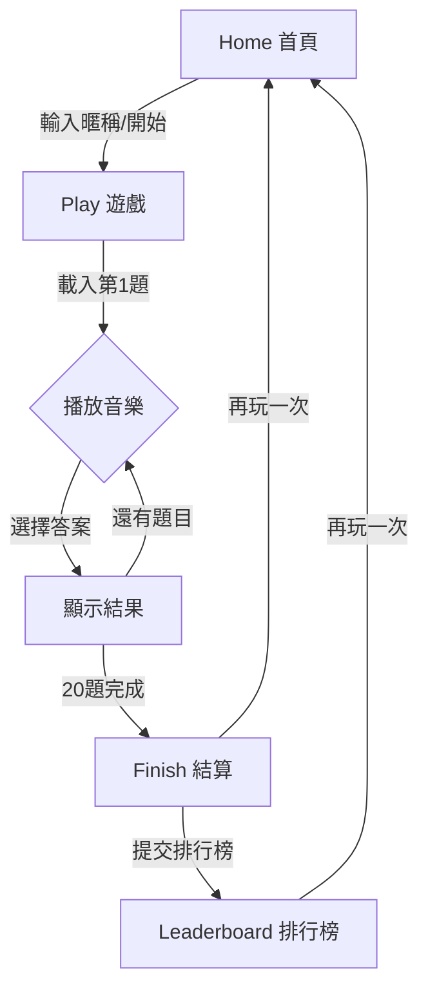

# Jay Guess PRD

> **版本**: 1.2.0  
> **更新時間**: 2025-12-30  
> **狀態**: 📝 Draft

---

## � 目錄

1. [產品概述](#-產品概述)
2. [目標](#-目標)
3. [非目標](#-非目標-non-goals)
4. [遊戲玩法](#-遊戲玩法)
5. [資料模型](#️-資料模型)
6. [API 端點](#-api-端點)
7. [錯誤處理](#-錯誤處理)
8. [版權與合規](#️-版權與合規)
9. [前端頁面](#️-前端頁面)
10. [效能與擴展性](#-效能與擴展性)
11. [安全性考量](#-安全性考量)
12. [測試策略](#-測試策略)
13. [環境配置](#️-環境配置)
14. [里程碑](#-里程碑)
15. [專案結構](#-專案結構)
16. [未來擴展](#-未來擴展)

---

## 📋 產品概述

| 項目 | 說明 |
|------|------|
| **名稱** | Jay Guess |
| **類型** | Web 應用程式 (RWD 響應式設計) |
| **標語** | 周杰倫猜歌 20 題競速，四選一，越快越高分，上排行榜 |
| **目標用戶** | 周杰倫歌迷、音樂愛好者、休閒遊戲玩家 |
| **模式** | 僅單人模式 |
| **前端框架** | Next.js 14 (App Router) |
| **樣式框架** | TailwindCSS |
| **語言** | TypeScript |
| **資料庫** | Supabase (PostgreSQL + Auth + Storage) |
| **音樂來源** | YouTube IFrame Player API (僅內嵌播放) |
| **部署平台** | Vercel (建議) |

### 技術棧強制約束

| 規範 | 說明 |
|------|------|
| **RLS** | 所有資料庫表必須啓用 Row Level Security |
| **Service Role Key** | 永遠不要在客戶端暴露 `SUPABASE_SERVICE_ROLE_KEY` |
| **Server Client** | 服務器端操作使用 `createServerClient` |
| **Browser Client** | 客戶端使用 `createBrowserClient` |
| **Supabase 配置** | 客戶端配置放在 `src/lib/supabase/` |

### 支援裝置與瀏覽器

| 平台 | 最低版本 |
|------|----------|
| Chrome | 90+ |
| Safari | 14+ |
| Firefox | 88+ |
| Edge | 90+ |
| iOS Safari | 14+ |
| Android Chrome | 90+ |

---

## 🎯 目標

### 主要目標
- ✅ 10 秒內開始遊戲並成功播放第一題
- ✅ 每局 20 題可在 4–7 分鐘內完成
- ✅ 結束後可提交排行榜並能快速查看排名
- ✅ 行動裝置與桌面裝置體驗一致

### 成功指標

| 指標 | 目標值 | 衡量方式 |
|------|--------|----------|
| 遊戲完成率 | ≥ 70% | `finished sessions / started sessions` |
| 排行榜提交率 | ≥ 35% | `submitted / finished sessions` |
| 中位數遊戲時長 | 360 秒 | `median(finished_at - started_at)` |
| 首次互動時間 (FCP) | < 1.5s | Lighthouse 測量 |
| 頁面載入時間 (LCP) | < 2.5s | Lighthouse 測量 |

---

## 🚫 非目標 (Non-Goals)

| 功能 | 原因 |
|------|------|
| ❌ 今日一題模式 | MVP 專注單一模式 |
| ❌ 多人房/即時對戰 | 需要 WebSocket，複雜度高 |
| ❌ 帳號系統 | 降低進入門檻 |
| ❌ 輸入歌名 | 四選一更直覺，降低挫折感 |
| ❌ 音檔下載/自託管 | 版權風險，維護成本高 |
| ❌ 多語言支援 | MVP 僅支援繁體中文 |

---

## 🎮 遊戲玩法

### 模式設定

| 設定項目 | 值 | 可配置 |
|----------|-----|--------|
| 模式名稱 | 20-song sprint | ❌ |
| 題目數量 | 20 題 | ✅ (env) |
| 答題方式 | 四選一 | ❌ |
| 答題機會 | 僅一次 | ❌ |
| 每題時限 | 15 秒 | ✅ (env) |
| 起始偏移 | 0 秒 | ❌ |
| 題目間隔 | 2 秒 | ✅ (env) |

> ⚠️ **自動播放限制**: 行動裝置需使用者互動才能播放 YouTube 內嵌

### 計分系統

分數由 **伺服器端計算**，參數如下：

| 參數 | 值 | 說明 | 可配置 |
|------|-----|------|--------|
| Smax | 100 | 最高分數 | ✅ |
| T | 15 秒 | 時間限制 | ✅ |
| p | 1.7 | 衰減指數 | ✅ |
| grace_ms | 500 | 網路延遲容錯 | ✅ |

**公式**:
```
score = round(Smax × (1 - t/T)^p)
```
- `t` = 答題時間 (0 ≤ t ≤ T)
- 答錯或超時 → 0 分

**計分範例**:

| 答題時間 | 得分 |
|----------|------|
| 0 秒 | 100 分 |
| 3 秒 | 72 分 |
| 7 秒 | 38 分 |
| 12 秒 | 10 分 |
| 15 秒 | 0 分 |
| 超時/答錯 | 0 分 |

### 選項生成規則

為確保公平性與遊戲體驗：

1. **正確答案**: 必定是四選項之一
2. **干擾選項**: 從題庫隨機選取 3 首不同歌曲
3. **去重規則**: 同一局遊戲中，干擾選項不重複出現超過 2 次
4. **選項順序**: 每題隨機打亂順序
5. **相似度考量**: (未來) 可排除同專輯歌曲作為干擾項

### 排行榜排序規則 (Tie-breakers)

1. `total_score` 降序 (分數越高越前)
2. `total_time_ms` 升序 (用時越短越前)
3. `created_at` 降序 (越新越前)

### 遊戲流程



### 詳細狀態流程

```
┌────────────────────────────────────────────────────────────────────────┐
│  Home                                                                  │
│  ┌─────────────┐   ┌─────────────┐   ┌─────────────┐                  │
│  │ 輸入暱稱    │ → │ 點擊開始    │ → │ API: start  │                  │
│  │ (max 12字)  │   │             │   │             │                  │
│  └─────────────┘   └─────────────┘   └─────────────┘                  │
└────────────────────────────────────────────────────────────────────────┘
                                ↓
┌────────────────────────────────────────────────────────────────────────┐
│  Play Loop (重複 20 次)                                                │
│  ┌─────────┐   ┌─────────┐   ┌─────────┐   ┌─────────┐   ┌─────────┐ │
│  │ loading │ → │ playing │ → │ answered│ → │ reveal  │ → │ next    │ │
│  │ 載入中  │   │ 播放中  │   │ 已選擇  │   │ 顯示結果│   │ 下一題  │ │
│  └─────────┘   └─────────┘   └─────────┘   └─────────┘   └─────────┘ │
│        ↑                                                      │       │
│        └──────────────────────────────────────────────────────┘       │
└────────────────────────────────────────────────────────────────────────┘
                                ↓
┌────────────────────────────────────────────────────────────────────────┐
│  Finish                                                                │
│  ┌─────────────┐   ┌─────────────┐   ┌─────────────┐                  │
│  │ 顯示總結    │ → │ 提交排行榜  │ → │ 查看排名    │                  │
│  │ 分數/正確率 │   │ API: finish │   │ 你的排名:#N │                  │
│  └─────────────┘   └─────────────┘   └─────────────┘                  │
└────────────────────────────────────────────────────────────────────────┘
```

### UI 狀態機

| 狀態 | 說明 | 可執行動作 |
|------|------|------------|
| `loading` | 載入中 | 無 |
| `ready_to_play` | 準備開始 | 點擊開始播放 |
| `playing` | 播放中/答題中 | 選擇答案 |
| `answered_reveal` | 已作答，顯示結果 | 無 (等待 2 秒) |
| `transition_next` | 過渡至下一題 | 無 |
| `timeout` | 超時未作答 | 無 (自動進入下一題) |
| `finished` | 遊戲結束 | 提交排行榜/再玩一次 |
| `error` | 發生錯誤 | 重試/返回首頁 |

---

## 🗃️ 資料模型

### ER Diagram

```
┌─────────────┐       ┌─────────────────┐       ┌─────────────────┐
│   songs     │       │  game_sessions  │       │  game_answers   │
├─────────────┤       ├─────────────────┤       ├─────────────────┤
│ id (PK)     │◄──────│ questions.song_id│      │ id (PK)         │
│ title_zh    │       │ id (PK)         │◄──────│ session_id (FK) │
│ youtube_id  │       │ nickname        │       │ question_index  │
│ start_sec   │       │ status          │       │ chosen_index    │
│ is_active   │       │ questions (JSON)│       │ is_correct      │
│ created_at  │       │ total_score     │       │ answer_time_ms  │
└─────────────┘       │ ...             │       │ score           │
                      └────────┬────────┘       └─────────────────┘
                               │
                               │ 1:1
                               ▼
                      ┌─────────────────────┐
                      │ leaderboard_entries │
                      ├─────────────────────┤
                      │ id (PK)             │
                      │ session_id (FK, UQ) │
                      │ nickname            │
                      │ total_score         │
                      │ correct_count       │
                      │ total_time_ms       │
                      │ created_at          │
                      └─────────────────────┘
```

### Supabase 資料表

#### 1. `songs` - 題庫

> 儲存歌曲 metadata，不存音檔

| 欄位 | 類型 | 約束 | 說明 |
|------|------|------|------|
| `id` | uuid | 🔑 PK, default: `gen_random_uuid()` | 主鍵 |
| `title_zh` | text | NOT NULL | 歌曲中文名稱 |
| `album` | text | nullable | 專輯名稱 |
| `year` | int | nullable | 發行年份 |
| `youtube_video_id` | text | UNIQUE, NOT NULL | YouTube 影片 ID |
| `start_sec` | int | default: 0 | 起始秒數 |
| `duration_sec` | int | nullable | 播放時長 (預設播放到答題結束) |
| `difficulty` | int | default: 1, check: 1-3 | 難度等級 (1=易, 2=中, 3=難) |
| `is_active` | boolean | default: true | 是否啟用 |
| `created_at` | timestamptz | default: now() | 建立時間 |
| `updated_at` | timestamptz | default: now() | 更新時間 |

**索引**:
- `idx_songs_active` ON `is_active` WHERE `is_active = true`
- `idx_songs_youtube` ON `youtube_video_id`

#### 2. `game_sessions` - 遊戲局數

> 每局題序與選項固定化（防作弊核心）

| 欄位 | 類型 | 約束 | 說明 |
|------|------|------|------|
| `id` | uuid | 🔑 PK | 主鍵 |
| `nickname` | text | nullable, max 12 chars | 玩家暱稱 |
| `status` | text | NOT NULL, check in ('active','finished','expired') | 狀態 |
| `max_questions` | int | default: 20 | 最大題數 |
| `time_limit_sec` | int | default: 15 | 每題時限 |
| `seed` | text | NOT NULL | 隨機種子 (用於重現) |
| `questions` | jsonb | NOT NULL | 題目資料 |
| `current_index` | int | default: 0 | 當前題目索引 |
| `started_at` | timestamptz | NOT NULL | 開始時間 |
| `expires_at` | timestamptz | NOT NULL | 過期時間 |
| `finished_at` | timestamptz | nullable | 結束時間 |
| `total_score` | int | default: 0 | 總分 |
| `correct_count` | int | default: 0 | 正確題數 |
| `total_time_ms` | int | default: 0 | 總答題時間 |
| `submit_token` | text | NOT NULL | 提交 Token (防重複提交) |
| `client_ip` | text | nullable | 客戶端 IP (防作弊追蹤) |
| `user_agent` | text | nullable | User Agent |
| `created_at` | timestamptz | default: now() | 建立時間 |

**索引**:
- `idx_sessions_status` ON `status`
- `idx_sessions_expires` ON `expires_at` WHERE `status = 'active'`

**`questions` JSONB 格式**:
```json
[
  {
    "q": 0,
    "song_id": "uuid",
    "options": ["uuid", "uuid", "uuid", "uuid"],
    "correct_index": 2
  }
]
```

#### 3. `game_answers` - 作答紀錄

> 逐題作答紀錄（驗證、除錯、可選回放）

| 欄位 | 類型 | 約束 | 說明 |
|------|------|------|------|
| `id` | uuid | 🔑 PK | 主鍵 |
| `session_id` | uuid | 🔗 FK → `game_sessions.id` ON DELETE CASCADE | 外鍵 |
| `question_index` | int | NOT NULL | 題目索引 |
| `chosen_index` | int | NOT NULL, check: 0-3 or -1 (timeout) | 選擇的選項 |
| `is_correct` | boolean | NOT NULL | 是否正確 |
| `answer_time_ms` | int | NOT NULL | 答題時間 (毫秒) |
| `score` | int | NOT NULL | 該題得分 |
| `answered_at` | timestamptz | default: now() | 作答時間 |

**約束**:
- `unique(session_id, question_index)`

**索引**:
- `idx_answers_session` ON `session_id`

#### 4. `leaderboard_entries` - 排行榜

> 排行榜摘要（查詢快速）

| 欄位 | 類型 | 約束 | 說明 |
|------|------|------|------|
| `id` | uuid | 🔑 PK | 主鍵 |
| `session_id` | uuid | 🔗 FK UNIQUE → `game_sessions.id` | 外鍵 (一局只能提交一次) |
| `nickname` | text | NOT NULL, default: '匿名玩家' | 玩家暱稱 |
| `total_score` | int | NOT NULL | 總分 |
| `correct_count` | int | NOT NULL | 正確題數 |
| `total_time_ms` | int | NOT NULL | 總答題時間 |
| `created_at` | timestamptz | default: now() | 建立時間 |

**索引**:
- `idx_leaderboard_rank` ON `total_score DESC, total_time_ms ASC, created_at DESC`
- `idx_leaderboard_session` ON `session_id`

### RLS (Row Level Security) 策略

```sql
-- songs: 公開讀取 (前端需要顯示歌名)
ALTER TABLE songs ENABLE ROW LEVEL SECURITY;
CREATE POLICY "songs_select" ON songs FOR SELECT USING (true);

-- game_sessions: 僅 service role 可存取
ALTER TABLE game_sessions ENABLE ROW LEVEL SECURITY;
-- 無公開 policy，僅 server 端可操作

-- game_answers: 僅 service role 可存取  
ALTER TABLE game_answers ENABLE ROW LEVEL SECURITY;
-- 無公開 policy，僅 server 端可操作

-- leaderboard_entries: 公開讀取
ALTER TABLE leaderboard_entries ENABLE ROW LEVEL SECURITY;
CREATE POLICY "leaderboard_select" ON leaderboard_entries FOR SELECT USING (true);
```

**設計原則**:
- 前端只讀 `songs` (歌名) 和 `leaderboard_entries`
- 開局/答題/結算一律走 Next.js API (Server 使用 service role)
- 避免前端直寫分數與 session，降低刷榜風險

---

## 🔌 API 端點

**Base URL**: `/api`

### 通用回應格式

**成功**:
```json
{
  "success": true,
  "data": { ... }
}
```

**失敗**:
```json
{
  "success": false,
  "error": {
    "code": "ERROR_CODE",
    "message": "人類可讀的錯誤訊息"
  }
}
```

---

### POST `/game/start`

開始新遊戲

**Request**:
```json
{
  "nickname": "string | null"  // max 12 chars, 會進行 trim 和過濾
}
```

**Response** (200):
```json
{
  "success": true,
  "data": {
    "sessionId": "uuid",
    "submitToken": "opaque_string",
    "timeLimitSec": 15,
    "totalQuestions": 20,
    "questionIndex": 0,
    "youtube": {
      "videoId": "dQw4w9WgXcQ",
      "startSec": 0
    },
    "options": ["七里香", "晴天", "稻香", "告白氣球"]
  }
}
```

**錯誤**:
| HTTP | Code | 說明 |
|------|------|------|
| 400 | `INVALID_NICKNAME` | 暱稱格式錯誤 |
| 500 | `INSUFFICIENT_SONGS` | 題庫歌曲不足 (<20) |
| 429 | `RATE_LIMITED` | 請求過於頻繁 |

---

### POST `/game/answer`

提交答案

**Request**:
```json
{
  "sessionId": "uuid",
  "questionIndex": 0,
  "chosenIndex": 2,
  "answerTimeMs": 3500
}
```

**Response** (200):
```json
{
  "success": true,
  "data": {
    "isCorrect": true,
    "correctIndex": 2,
    "correctTitle": "稻香",
    "scoreGained": 72,
    "totalScore": 72,
    "isFinished": false,
    "progress": {
      "current": 1,
      "total": 20,
      "correctCount": 1
    },
    "next": {
      "questionIndex": 1,
      "youtube": {
        "videoId": "abc123",
        "startSec": 0
      },
      "options": ["青花瓷", "東風破", "蘭亭序", "煙花易冷"]
    }
  }
}
```

**錯誤**:
| HTTP | Code | 說明 |
|------|------|------|
| 400 | `INVALID_SESSION` | Session 不存在 |
| 400 | `SESSION_EXPIRED` | Session 已過期 |
| 400 | `SESSION_FINISHED` | Session 已結束 |
| 400 | `INVALID_QUESTION_INDEX` | 題目索引不符 |
| 400 | `INVALID_CHOICE` | 選項索引超出範圍 |
| 400 | `ALREADY_ANSWERED` | 該題已作答 |

---

### POST `/game/finish`

結束遊戲並提交排行榜

**Request**:
```json
{
  "sessionId": "uuid",
  "submitToken": "opaque_string"
}
```

**Response** (200):
```json
{
  "success": true,
  "data": {
    "totalScore": 1580,
    "correctCount": 18,
    "totalQuestions": 20,
    "accuracy": 0.9,
    "totalTimeMs": 45000,
    "averageTimeMs": 2250,
    "rank": 42,
    "totalPlayers": 1000,
    "isNewHighScore": false
  }
}
```

**錯誤**:
| HTTP | Code | 說明 |
|------|------|------|
| 400 | `INVALID_SESSION` | Session 不存在 |
| 400 | `INVALID_TOKEN` | Token 不符 |
| 400 | `ALREADY_SUBMITTED` | 已提交過排行榜 |
| 400 | `SESSION_NOT_FINISHED` | 遊戲尚未完成 20 題 |

---

### GET `/leaderboard`

取得排行榜

**Query Parameters**:
| 參數 | 類型 | 預設值 | 說明 |
|------|------|--------|------|
| `limit` | int | 50 | 最多 100 |
| `offset` | int | 0 | 分頁偏移 |

**Response** (200):
```json
{
  "success": true,
  "data": {
    "entries": [
      {
        "rank": 1,
        "nickname": "周杰倫本人",
        "totalScore": 1980,
        "correctCount": 20,
        "totalTimeMs": 25000,
        "createdAt": "2025-12-30T10:00:00Z"
      }
    ],
    "total": 1000,
    "hasMore": true
  }
}
```

---

### GET `/game/session/:id`

查詢遊戲結果 (用於結果頁面刷新)

**Response** (200):
```json
{
  "success": true,
  "data": {
    "status": "finished",
    "totalScore": 1580,
    "correctCount": 18,
    "totalTimeMs": 45000,
    "answers": [
      {
        "questionIndex": 0,
        "correctTitle": "稻香",
        "chosenTitle": "稻香",
        "isCorrect": true,
        "score": 85
      }
    ]
  }
}
```

---

### 驗證與防作弊規則

| 規則 | 說明 |
|------|------|
| ✅ Session 狀態 | 必須 `active` 且未過期 |
| ✅ 題目順序 | `questionIndex` 必須等於 `current_index` |
| ✅ 選項範圍 | `chosenIndex` 必須在 0-3 |
| ✅ 時間範圍 | `answerTimeMs` 必須在 `0..(T×1000 + 500ms)` |
| ✅ 重複提交 | 同一題不可重複作答 |
| ✅ 排行榜唯一 | 每個 session 只能提交一次 |
| ✅ Token 驗證 | `submitToken` 必須與 session 匹配 |
| 🔜 IP 速率限制 | 同 IP 每分鐘最多開始 5 局 |
| 🔜 可疑行為偵測 | 全對 + 極短時間 → 標記審核 |

---

## ⚠️ 錯誤處理

### 錯誤代碼對照表

| Code | HTTP | 使用者提示 |
|------|------|------------|
| `INVALID_NICKNAME` | 400 | 暱稱格式不正確，請使用 1-12 個字元 |
| `INVALID_SESSION` | 400 | 找不到遊戲，請重新開始 |
| `SESSION_EXPIRED` | 400 | 遊戲已逾時，請重新開始 |
| `SESSION_FINISHED` | 400 | 遊戲已結束 |
| `INVALID_QUESTION_INDEX` | 400 | 題目順序錯誤，請重新整理頁面 |
| `INVALID_CHOICE` | 400 | 無效的選項 |
| `ALREADY_ANSWERED` | 400 | 該題已作答 |
| `INVALID_TOKEN` | 400 | 驗證失敗，請重新開始遊戲 |
| `ALREADY_SUBMITTED` | 400 | 成績已提交過排行榜 |
| `INSUFFICIENT_SONGS` | 500 | 系統錯誤，請稍後再試 |
| `RATE_LIMITED` | 429 | 操作過於頻繁，請稍後再試 |
| `INTERNAL_ERROR` | 500 | 系統錯誤，請稍後再試 |

### 前端錯誤處理策略

| 情境 | 處理方式 |
|------|----------|
| 網路斷線 | 顯示提示，允許重試 |
| API 回應慢 | 顯示 loading，15 秒後 timeout |
| Session 過期 | 導向首頁，顯示"遊戲已逾時" |
| YouTube 載入失敗 | 顯示"影片載入中..."，3 秒後重試，最多 3 次 |
| 未知錯誤 | 顯示通用錯誤訊息，提供返回首頁按鈕 |

---

## ⚖️ 版權與合規

### YouTube API 使用規範

- ✅ 使用 YouTube IFrame Player API 內嵌播放
- ✅ 不下載、不儲存、不重新散佈音檔
- ✅ 遵守 YouTube ToS，不繞過廣告或取流
- ✅ 顯示 YouTube 標誌 (API 要求)
- ✅ 不修改或遮蓋播放器控制項

### 隱私權

- 不收集個人識別資訊 (PII)
- 暱稱為選填，不做驗證
- IP 僅用於防作弊，不公開顯示
- 遊戲紀錄保留 90 天後自動清除 (建議)

---

## 🖥️ 前端頁面

### 頁面結構

| 路徑 | 名稱 | SEO Title | 功能 |
|------|------|-----------|------|
| `/` | Home | Jay Guess - 周杰倫猜歌挑戰 | 暱稱輸入、開始按鈕、簡易規則說明 |
| `/play` | Play | 遊戲中 - Jay Guess | YouTube 播放器、計時器、四選一、進度 |
| `/result` | Result | 遊戲結果 - Jay Guess | 分數總結、正確率、提交排行榜按鈕 |
| `/leaderboard` | Leaderboard | 排行榜 - Jay Guess | Top N 列表、自己的排名高亮 |

### UI 元件清單

| 元件 | 說明 |
|------|------|
| `<YouTubePlayer />` | 封裝 YouTube IFrame API |
| `<Timer />` | 倒數計時器 (15→0) |
| `<OptionButton />` | 選項按鈕 (4 個) |
| `<ProgressBar />` | 進度條 (1/20) |
| `<ScoreDisplay />` | 分數顯示 |
| `<Leaderboard />` | 排行榜表格 |
| `<ResultSummary />` | 結果總結卡片 |
| `<LoadingSpinner />` | 載入動畫 |
| `<ErrorBoundary />` | 錯誤邊界 |

### 響應式斷點

| 斷點 | 寬度 | 佈局 |
|------|------|------|
| Mobile | < 640px | 單欄，按鈕全寬 |
| Tablet | 640-1024px | 雙欄，播放器較大 |
| Desktop | > 1024px | 居中容器，最大寬度 1200px |

### 動畫效果

| 元素 | 動畫 | 時長 |
|------|------|------|
| 計時器 | 抖動 (剩餘 3 秒) | 0.3s |
| 選項按鈕 | hover 放大 | 0.15s |
| 正確/錯誤 | 背景色變化 | 0.3s |
| 分數增加 | 數字跳動 | 0.5s |
| 頁面切換 | 淡入淡出 | 0.2s |

### 實作注意事項

1. **計時方式**: 使用 `Date.now()` 計算 `answerTimeMs`，比依賴 player `currentTime` 更穩定
2. **題目切換**: 使用 `loadVideoById({videoId, startSeconds: 0})` 並重置 timer
3. **播放觸發**: 播放必須由使用者點擊觸發 (Start/Next) - 行動裝置限制
4. **防止返回**: 遊戲中禁用瀏覽器返回按鈕，避免作弊
5. **離開提示**: 遊戲中關閉/離開頁面時顯示確認對話框
6. **Session 存儲**: 使用 sessionStorage 暫存遊戲狀態，避免重整遺失

### 🎬 YouTube 標題隱藏方案 (關鍵)

#### ⚠️ 問題說明

YouTube IFrame Player 預設會在播放器上顯示影片標題，這會**直接洩露答案**給玩家：

| 時機 | 標題可見性 |
|------|------------|
| 播放器載入時 | ⚠️ 會顯示標題 |
| Hover 滑鼠時 | ⚠️ 會顯示標題 |
| 暫停/播放切換 | ⚠️ 會顯示標題 |
| 播放中（幾秒後） | ✅ 標題會自動消失 |

> **注意**: YouTube 在 2018 年棄用 `showinfo` 參數，2023 年棄用 `modestbranding` 參數，目前**沒有官方 API 可隱藏標題**。

#### 解決方案比較

| 方案 | 效果 | 複雜度 | YouTube ToS | 推薦 |
|------|------|--------|-------------|------|
| A. CSS 遮罩/裁切 | ⭐⭐⭐ | 低 | ⚠️ 灰色地帶 | ✅ |
| B. 音訊視覺化 | ⭐⭐⭐⭐⭐ | 中 | ✅ 合規 | ⭐ 最推薦 |
| C. 隱藏播放器 | ⭐⭐⭐⭐ | 低 | ⚠️ 灰色地帶 | ✅ |

---

#### 方案 A：CSS 遮罩法

用 CSS 裁切掉播放器頂部的標題區域：

```css
.youtube-container {
  position: relative;
  overflow: hidden;
  aspect-ratio: 16 / 9;
  border-radius: 12px;
  background: #000;
}

.youtube-container iframe {
  position: absolute;
  top: -60px;  /* 裁切標題區域 */
  left: 0;
  width: 100%;
  height: calc(100% + 120px);  /* 補償裁切 */
  pointer-events: none;  /* 禁止點擊控制項 */
}

/* 漸層遮罩美化邊緣 */
.youtube-container::before {
  content: '';
  position: absolute;
  top: 0;
  left: 0;
  right: 0;
  height: 40px;
  background: linear-gradient(to bottom, #000 0%, transparent 100%);
  z-index: 10;
  pointer-events: none;
}
```

**優點**: 實作簡單  
**缺點**: 底部控制項也會被裁切，需要自製播放控制

---

#### 方案 B：音訊視覺化 (⭐ 推薦)

將 YouTube 播放器完全隱藏，只用於播放音訊，前端顯示自訂的音訊視覺化介面：

```tsx
// components/game/AudioPlayer.tsx
export function AudioPlayer({ isPlaying }: { isPlaying: boolean }) {
  return (
    <div className="audio-player">
      {/* 隱藏的 YouTube 播放器 */}
      <div className="youtube-hidden" aria‑hidden="true">
        <YouTubeEmbed ... />
      </div>
      
      {/* 自訂視覺化介面 */}
      <div className="visualizer-container">
        <div className="album-art">
          
          <div className={`pulse-ring ${isPlaying ? 'animate' : ''}`} />
        </div>
        <WaveformAnimation isPlaying={isPlaying} />
        <p className="hint">🎵 聽音樂猜歌名...</p>
      </div>
    </div>
  );
}
```

```css
.youtube-hidden {
  position: absolute;
  width: 1px;
  height: 1px;
  overflow: hidden;
  opacity: 0;
  pointer-events: none;
}

.visualizer-container {
  display: flex;
  flex-direction: column;
  align-items: center;
  justify-content: center;
  height: 300px;
  background: linear-gradient(135deg, #1a1a2e 0%, #16213e 100%);
  border-radius: 16px;
}

.album-art {
  position: relative;
  width: 120px;
  height: 120px;
}

.pulse-ring {
  position: absolute;
  inset: -10px;
  border: 2px solid rgba(255, 255, 255, 0.3);
  border-radius: 50%;
}

.pulse-ring.animate {
  animation: pulse 1.5s ease-out infinite;
}

@keyframes pulse {
  0% { transform: scale(1); opacity: 1; }
  100% { transform: scale(1.5); opacity: 0; }
}
```

**優點**: 
- 最佳使用者體驗
- 完全符合 YouTube ToS（播放器只是不可見，沒有修改）
- 可設計更有音樂遊戲感的介面

**缺點**: 需要額外設計視覺化動畫

---

#### 方案 C：極簡隱藏播放器

將播放器縮到最小並隱藏，純粹當作音訊播放器：

```tsx
<div className="game-container">
  {/* 隱藏的 YouTube (1x1 像素) */}
  <iframe
    src={`https://www.youtube.com/embed/${videoId}?enablejsapi=1&controls=0`}
    style={{
      position: 'absolute',
      width: '1px',
      height: '1px',
      opacity: 0,
      pointerEvents: 'none'
    }}
  />
  
  {/* 顯示簡單的播放提示 */}
  <div className="now-playing">
    <span className="music-icon">🎵</span>
    <span>正在播放第 {currentQuestion}/20 題</span>
  </div>
</div>
```

**優點**: 最簡單的實作  
**缺點**: 沒有視覺回饋，體驗較單調

---

#### 🎯 實作建議

**MVP 階段**: 使用方案 C（隱藏播放器 + 簡單提示文字）

**正式版**: 升級到方案 B（音訊視覺化），可考慮的視覺元素：
- 音波動畫 (CSS/Canvas)
- 周杰倫剪影 + 脈動效果
- 專輯封面馬賽克（不顯示完整封面避免提示）
- 倒數計時圓環
- 頻譜分析動畫

---

## ⚡ 效能與擴展性

### 效能目標

| 指標 | 目標 | 衡量工具 |
|------|------|----------|
| First Contentful Paint (FCP) | < 1.5s | Lighthouse |
| Largest Contentful Paint (LCP) | < 2.5s | Lighthouse |
| Time to Interactive (TTI) | < 3.5s | Lighthouse |
| Cumulative Layout Shift (CLS) | < 0.1 | Lighthouse |
| API 回應時間 (p95) | < 200ms | Monitoring |

### 優化策略

| 項目 | 策略 |
|------|------|
| **靜態資源** | Vercel Edge CDN 快取 |
| **API 回應** | Supabase Connection Pooling |
| **排行榜查詢** | 建立複合索引，使用 limit 限制 |
| **YouTube 預載** | 下一題影片提前 preload |
| **Bundle 大小** | 動態 import，code splitting |
| **圖片** | Next.js Image 最佳化 |

### 擴展性考量

| 預估規模 | 策略 |
|----------|------|
| DAU < 1,000 | Supabase Free tier 足夠 |
| DAU 1,000-10,000 | Supabase Pro，考慮 read replica |
| DAU > 10,000 | 排行榜 Redis 快取，API Edge Functions |

---

## 🔐 安全性考量

### 威脅與對策

| 威脅 | 風險 | 對策 |
|------|------|------|
| 分數竄改 | 高 | 伺服器端計分，前端分數僅顯示用 |
| 重複提交 | 中 | submitToken 一次性驗證 |
| Session 猜測 | 低 | UUID v4 不可預測 |
| 暴力刷榜 | 中 | IP 速率限制 (5局/分鐘) |
| XSS | 中 | 暱稱過濾、React 自動轉義 |
| SQL Injection | 低 | Supabase parameterized queries |
| CSRF | 低 | API Routes 無狀態 |

### 輸入驗證

| 欄位 | 驗證規則 |
|------|----------|
| `nickname` | trim, 1-12 字元, 過濾特殊字元 |
| `sessionId` | UUID 格式 |
| `questionIndex` | 0-19 整數 |
| `chosenIndex` | 0-3 整數 |
| `answerTimeMs` | 0-15500 整數 |

---

## 🧪 測試策略

### 單元測試

| 模組 | 測試重點 |
|------|----------|
| `scoring.ts` | 計分公式正確性 |
| `questionGenerator.ts` | 選項生成邏輯、去重規則 |
| `validation.ts` | 輸入驗證函數 |

### 整合測試

| 場景 | 測試項目 |
|------|----------|
| 完整遊戲流程 | start → 20 answers → finish |
| 超時處理 | 15 秒無回應自動跳題 |
| 併發提交 | 同時多次 finish 只接受一次 |
| 錯誤回應 | 各種 error code 正確觸發 |

### E2E 測試

| 場景 | 工具 |
|------|------|
| 桌面版遊戲流程 | Playwright |
| 行動版遊戲流程 | Playwright mobile viewport |
| 排行榜顯示 | Playwright |

### 測試覆蓋率目標

| 類型 | 目標 |
|------|------|
| 單元測試 | > 80% |
| 整合測試 | 核心 API 100% |
| E2E 測試 | 主流程 100% |

---

## 🛠️ 環境配置

### 環境變數

```env
# Supabase
NEXT_PUBLIC_SUPABASE_URL=https://xxx.supabase.co
NEXT_PUBLIC_SUPABASE_ANON_KEY=eyJ...
SUPABASE_SERVICE_ROLE_KEY=eyJ...  # 僅 server 端

# Game Config
GAME_QUESTION_COUNT=20
GAME_TIME_LIMIT_SEC=15
GAME_SCORE_MAX=100
GAME_SCORE_DECAY=1.7
GAME_GRACE_MS=500

# Rate Limit
RATE_LIMIT_START_PER_MINUTE=5

# Feature Flags
FEATURE_LEADERBOARD=true
```

### 運行命令

| 命令 | 說明 |
|------|------|
| `npm run dev` | 啟動開發伺服器 |
| `npm run build` | 構建生產版本 |
| `npm run start` | 啟動生產伺服器 |
| `npm run lint` | 執行 ESLint 檢查 |
| `npx supabase db push` | 推送 migrations 到 Supabase |
| `npx supabase gen types typescript` | 生成 TypeScript 類型 |

### 部署檢查清單

- [ ] 環境變數已設定
- [ ] Supabase migrations 已執行
- [ ] RLS policies 已啟用
- [ ] 題庫至少 50 首歌
- [ ] TailwindCSS 正確編譯
- [ ] YouTube embed 在各平台測試通過
- [ ] Error tracking (Sentry) 已設定
- [ ] Analytics (Vercel Analytics) 已啟用

---

## 🚀 里程碑

### M1: Playable Loop (Week 1-2)

> 基礎可玩循環

| 任務 | 狀態 | 優先級 |
|------|------|--------|
| songs table seeded (≥50首) | ⬜ | P0 |
| Home 頁面 (暱稱 + 開始) | ⬜ | P0 |
| Play 頁面 (YouTube + 選項) | ⬜ | P0 |
| POST `/game/start` API | ⬜ | P0 |
| POST `/game/answer` API | ⬜ | P0 |
| 計時器 + 超時處理 | ⬜ | P0 |
| 行動裝置 gesture 播放 | ⬜ | P0 |
| 基礎錯誤處理 | ⬜ | P1 |

---

### M2: Verified Scoring + Leaderboard (Week 3)

> 驗證計分與排行榜

| 任務 | 狀態 | 優先級 |
|------|------|--------|
| Server-side scoring | ⬜ | P0 |
| game_answers 資料持久化 | ⬜ | P0 |
| Result 頁面 | ⬜ | P0 |
| POST `/game/finish` API | ⬜ | P0 |
| Leaderboard 頁面 | ⬜ | P0 |
| GET `/leaderboard` API | ⬜ | P0 |
| 自己排名高亮 | ⬜ | P1 |
| 社群分享按鈕 | ⬜ | P2 |

---

### M3: Polish (Week 4)

> 細節優化

| 任務 | 狀態 | 優先級 |
|------|------|--------|
| Anti-repeat options rule | ⬜ | P1 |
| Latency grace handling (500ms) | ⬜ | P1 |
| Loading/transition 動畫 | ⬜ | P1 |
| Rate limit (5局/分鐘) | ⬜ | P1 |
| Error boundary 全局處理 | ⬜ | P1 |
| SEO meta tags | ⬜ | P2 |
| PWA 支援 | ⬜ | P2 |
| Analytics 埋點 | ⬜ | P2 |

---

## 📁 專案結構

```
jay-guess/
├── src/
│   ├── app/                        # Next.js App Router
│   │   ├── layout.tsx              # Root layout
│   │   ├── page.tsx                # Home (/)
│   │   ├── play/
│   │   │   └── page.tsx            # Play (/play)
│   │   ├── result/
│   │   │   └── page.tsx            # Result (/result)
│   │   ├── leaderboard/
│   │   │   └── page.tsx            # Leaderboard (/leaderboard)
│   │   ├── api/
│   │   │   ├── game/
│   │   │   │   ├── start/route.ts
│   │   │   │   ├── answer/route.ts
│   │   │   │   ├── finish/route.ts
│   │   │   │   └── [id]/route.ts   # Session query
│   │   │   └── leaderboard/route.ts
│   │   └── globals.css
│   ├── components/
│   │   ├── ui/                     # 基礎 UI (Button, Input, ...)
│   │   ├── game/                   # 遊戲相關 (Timer, Options, ...)
│   │   └── layout/                 # 佈局 (Header, Footer, ...)
│   ├── hooks/
│   │   ├── useGameSession.ts
│   │   ├── useTimer.ts
│   │   └── useYouTubePlayer.ts
│   ├── lib/
│   │   ├── supabase/
│   │   │   ├── client.ts           # createBrowserClient (客戶端)
│   │   │   └── server.ts           # createServerClient (服務器端)
│   │   ├── scoring.ts              # 計分邏輯
│   │   ├── questionGenerator.ts    # 題目生成
│   │   └── validation.ts           # 輸入驗證
│   ├── types/
│   │   ├── database.ts             # Supabase generated types
│   │   ├── api.ts                  # API request/response types
│   │   └── game.ts                 # Game state types
│   └── constants/
│       └── config.ts               # 遊戲配置常數
├── supabase/
│   ├── migrations/
│   │   ├── 001_create_songs.sql
│   │   ├── 002_create_sessions.sql
│   │   ├── 003_create_answers.sql
│   │   ├── 004_create_leaderboard.sql
│   │   └── 005_create_indexes.sql
│   └── seed.sql                    # 題庫種子資料
├── public/
│   ├── favicon.ico
│   └── og-image.png                # 社群分享圖
├── tests/
│   ├── unit/
│   ├── integration/
│   └── e2e/
├── .env.local.example
├── package.json
├── tsconfig.json
├── tailwind.config.ts              # TailwindCSS 配置
├── postcss.config.js               # PostCSS 配置
└── README.md
```

---

## 🔮 未來擴展

以下功能不在 MVP 範圍，但保留技術擴展性：

| 功能 | 難度 | 備註 |
|------|------|------|
| 🎵 今日一曲 (Daily Challenge) | 中 | 每日一題，全球同題 |
| 🏆 週排行/月排行 | 低 | 增加 `period` 欄位 |
| 👥 好友挑戰 | 高 | 需要帳號系統 |
| 🎨 主題切換 (暗黑模式) | 低 | CSS 變數 |
| 🌏 多語言 | 中 | i18n 架構 |
| 📊 個人統計 | 中 | 需要帳號系統或 localStorage |
| 🎤 其他歌手題庫 | 低 | 增加 `artist` 欄位 |
| 🔊 難度選擇 | 低 | 已有 difficulty 欄位設計 |

---

## 📝 變更日誌

| 版本 | 日期 | 變更內容 |
|------|------|----------|
| 1.2.0 | 2025-12-30 | 根據技術棧規範更新：加入 TailwindCSS、Supabase 客戶端命名規範、運行命令 |
| 1.1.0 | 2025-12-30 | 新增錯誤處理、安全性、測試策略、效能指標、YouTube 標題隱藏方案 |
| 1.0.0 | 2025-12-30 | 初始版本 |

---

*最後更新: 2025-12-30 22:23*

